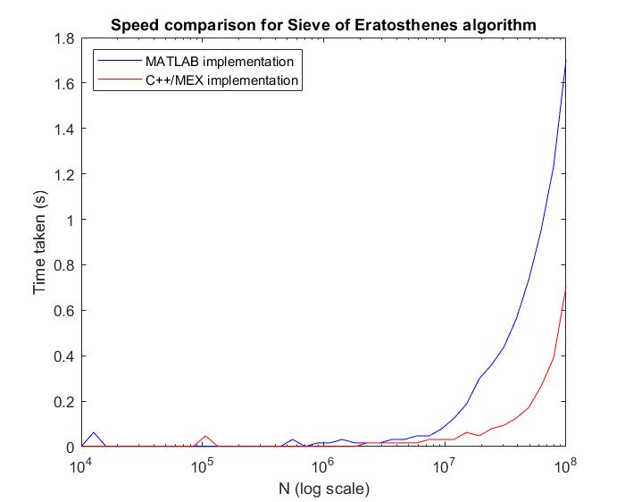
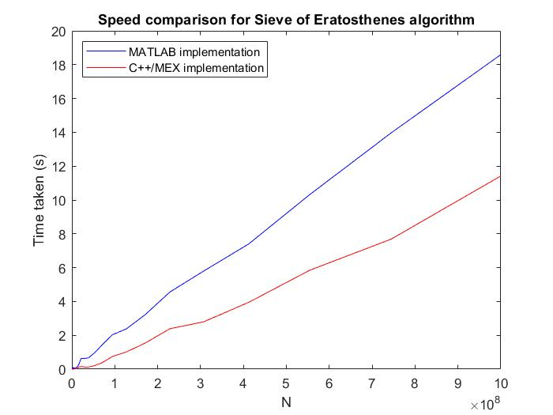

# mex-experiments
Trying out integrating C++ functions with MATLAB for faster runtimes

Here, the `sieve.cpp` and the `count_primes.m` functions are the exact same Sieve of Eratosthenes algorithm, implemented identically. Then I compiled the .cpp file into a mex library, and compared the speeds of running both of them using the program "graph_sieve_timings.m"

Results are looking good! Even with such a simple algorithm, the C++ implementation absolutely smokes the matlab one, performing on average 1.6 times faster!

| Log scale | Linear scale |
|:---:|:---:|
| | |

However, there is a small initial overhead when calling a mex function, so you don't want to be calling the same mex function over and over again if you can help it - better to incorporate any loops into the mex function itself so you only suffer the (tiny) overhead once.
